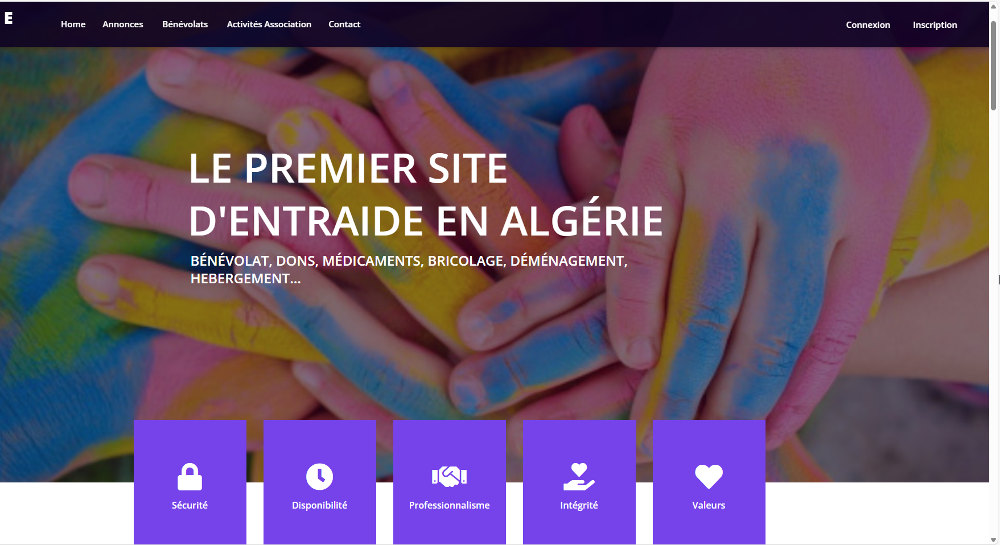

# MUTUAL AID PLATFORM DZ-AIDE
<!--
Hey, thanks for using the awesome-readme-template template.  
If you have any enhancements, then fork this project and create a pull request 
or just open an issue with the label "enhancement".

Don't forget to give this project a star for additional support ;)
Maybe you can mention me or this repo in the acknowledgements too
-->
<div align="center">

  

  

  


   

</div>

<br />


## :star2: About the Project
DISCOVER YOUR MUTUAL AID PLATFORM
DZ-AIDE

Do you need help? (blood donations, hard-to-find medications, moving, private lessons, fundraising for an association or volunteering, cleaning up a green space, or even help with DIY work) DzAide is here to connect you with people (individuals, associations, professionals...) who are ready to help you.

Want to help but don't know where to start? On DzAide, you can also offer your services to others (individuals, associations, professionals...) to assist them—whether it's assembling furniture, giving math or reading lessons to hospitalized children, making donations to an association, or participating in volunteer efforts.

<!-- Screenshots -->
### :camera: Screenshots

<div align="center"> 
  
  
  
  


</div>


<!-- TechStack -->


<!-- Getting Started -->
## 	:gear: Installation


- Clone the repository using the command "git clone"
- Create database in MySql
- Configure the .env file accordingly


Install  with composer

```bash
$composer install
$php artisan migrate
$php artisan serve
$php artisan storage:link
```
   
<!-- Running Tests -->
## :test_tube: Built With

- Bootstrap- CSS framework
- JQuery- Javascript framework
- Laravel - PHP framework
- MySql- Databse

